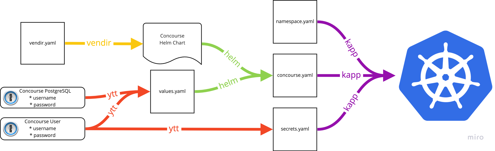

# Concourse

This deploys [Concourse](https://concourse-ci.org/), the best CI/CD tool ever. I have written more information about the deployment process and my reasoning behind using specific tools on [my website](https://petewall.net/continuous-thing-doer/).

## Deployment process

This deployment utilizes the Concourse [Helm chart](https://github.com/concourse/concourse-chart), but it does not use Helm to deploy it. We utilize a combination of `helm`, `ytt`, and `vendir` to create a set of Kubernetes objects that then get deployed with `kapp`.




## Installing

```bash
make deploy
```
