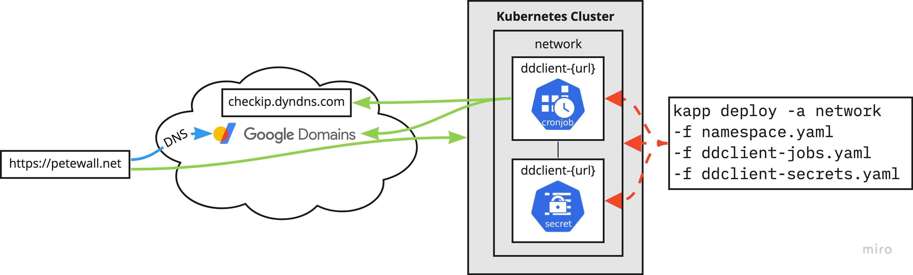

# Network

This deploys systems that are used to assist and augment the networking of the cluster and the lab it is in.

## Components

### DDclient

[Ddclient](https://github.com/linuxserver/docker-ddclient) is the client used to update dynamic DNS entries. This deployment allows for a pod to periodically check the lab's external IP address and update Google domains. The client requires a `ddclient.conf` config file. This file contains secrets, so the whole file is held within my 1Password password manager and deployed on-demand.



## Installing

```bash
make deploy
```
